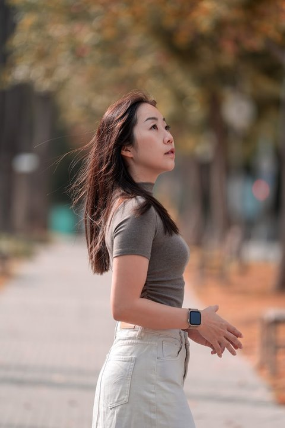
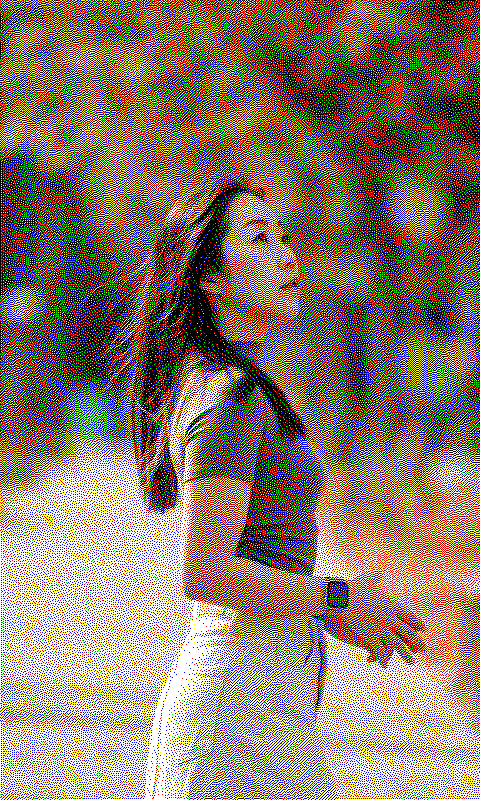
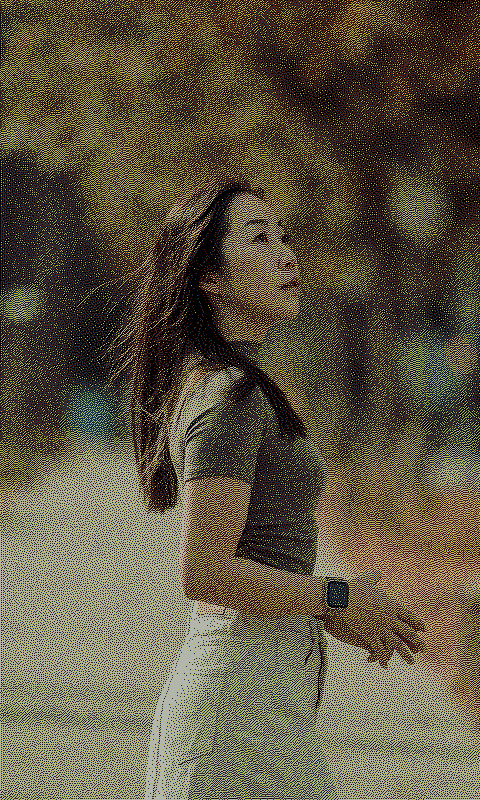
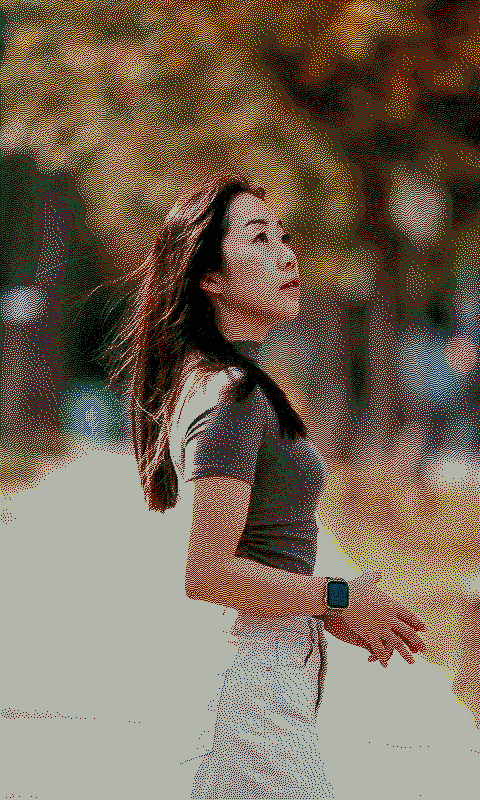

# ESP32-S3 PhotoFrame


A modern, feature-rich firmware for the **Waveshare ESP32-S3-PhotoPainter** that replaces the stock firmware with a powerful RESTful API, web interface, and **significantly better image quality**. This firmware provides superior image management, automatic rotation handling, drag-and-drop uploads, and intelligent power management.

**Product Page**: [Waveshare ESP32-S3-PhotoPainter](https://www.waveshare.com/wiki/ESP32-S3-PhotoPainter)

## Image Quality Comparison

Our firmware uses a **measured color palette** for superior image rendering compared to the stock firmware. The images below show simulated results of what you'll see on the actual e-paper display:

> **⚠️ Note**: The stock algorithm may look acceptable on computer displays, but when flashed onto the actual e-paper device, the colors appear washed out and the image quality is significantly degraded. This is because the stock algorithm uses theoretical RGB values that don't match the physical characteristics of the e-paper display. Our enhanced algorithm with measured palette produces images that look much better on the actual device.

**🎨 [Try the Interactive Demo](https://aitjcize.github.io/esp32-photoframe/)** - Drag the slider to compare algorithms in real-time with your own images!

<table>
<tr>
<td align="center"><b>Original Image</b></td>
<td align="center"><b>Stock Algorithm<br/>(on computer)</b></td>
<td align="center"><b>Stock Algorithm<br/>(on device)</b></td>
<td align="center"><b>Our Algorithm<br/>(on device)</b></td>
</tr>
<tr>
<td><a href="https://github.com/aitjcize/esp32-photoframe/raw/refs/heads/main/.img/sample.jpg"></a></td>
<td><a href="https://github.com/aitjcize/esp32-photoframe/raw/refs/heads/main/.img/stock_algorithm_on_computer.bmp"></a></td>
<td><a href="https://github.com/aitjcize/esp32-photoframe/raw/refs/heads/main/.img/stock_algorithm.bmp"></a></td>
<td><a href="https://github.com/aitjcize/esp32-photoframe/raw/refs/heads/main/.img/our_algorithm.bmp"></a></td>
</tr>
<tr>
<td align="center">Source JPEG</td>
<td align="center">Theoretical palette<br/>(looks OK on screen)</td>
<td align="center">Theoretical palette<br/>(washed out on device)</td>
<td align="center">Measured palette<br/>(accurate colors)</td>
</tr>
</table>

**Why Our Algorithm is Better:**

- ✅ **Accurate Color Matching**: Uses actual measured e-paper colors
- ✅ **Better Dithering**: Floyd-Steinberg algorithm with measured palette produces more natural color transitions
- ✅ **Optimized Contrast**: Default 1.1× contrast with neutral brightness preserves image tonality
- ✅ **No Over-Saturation**: Avoids the washed-out appearance of theoretical palette matching

The measured palette accounts for the fact that e-paper displays show darker, more muted colors than pure RGB values. By dithering with these actual colors, the firmware makes better decisions about which palette color to use for each pixel, resulting in images that look significantly better on the physical display.

📖 **[Read the technical deep-dive on measured color palettes →](docs/MEASURED_PALETTE.md)**

## Why This Firmware?

This custom firmware is **better than the stock firmware** because it offers:

- ✅ **Modern Web Interface**: Real-time image preview with S-curve tone mapping
- **🎨 [Try Our Demo](https://aitjcize.github.io/esp32-photoframe/)**: Test the enhanced image processing algorithm in your browser before flashing!
- **RESTful API**: Complete HTTP API for image management and device control
- **Web Interface**: Modern, responsive web UI for easy management
- **Smart Image Processing**: Automatic JPEG processing with rotation and BMP conversion before upload
- ✅ **S-Curve Tone Mapping**: Professional tone mapping with adjustable shadow/highlight control
- ✅ **Real-Time Preview**: See exactly how images will look on e-paper before uploading
- ✅ **JPEG Thumbnails**: Fast-loading gallery with original orientation preserved
- ✅ **Intelligent Power Management**: Auto-sleep with HTTP activity detection

## Features

### Image Management
- **Drag & Drop Upload**: Simply drag JPEG files into the browser
- **Real-Time Preview**: See processed image with measured palette simulation before upload
- **S-Curve Tone Mapping**: Adjustable strength, shadow boost, highlight compression, and midpoint
- **Saturation Control**: Fine-tune color vibrancy (0.5-2.0x)
- **Color Matching Methods**: Choose between Simple RGB or LAB color space for dithering
- **Smart Resizing**: Client-side scaling to exact display dimensions (800×480 or 480×800)
- **Portrait Detection**: Automatically rotates portrait images for landscape display
- **Thumbnail Gallery**: Fast-loading JPEG thumbnails in original orientation
- **Floyd-Steinberg Dithering**: Professional 7-color palette conversion with measured color palette

### Web Interface
- **Responsive Design**: Works on desktop and mobile browsers
- **Live Preview Canvas**: Real-time rendering with measured palette simulation
- **S-Curve Visualization**: Interactive graph showing tone mapping curve
- **Parameter Controls**: Sliders for all processing parameters with live updates
- **Standalone Mode**: Works offline for testing (serve with any HTTP server)

### Power Management
- **Smart Auto-Sleep**: 2-minute timeout with HTTP activity detection
- **Boot Button Wake**: Press to wake and access web interface
- **Sleep Timer Reset**: Any web interaction keeps device awake

## Hardware

**Device**: Waveshare ESP32-S3-PhotoPainter

**Specifications**:
- **MCU**: ESP32-S3-WROOM-1-N16R8 (16MB Flash, 8MB PSRAM)
- **Display**: 7.3" ACeP 7-Color E-Paper (800×480 pixels)
- **Colors**: Black, White, Red, Yellow, Blue, Green, Orange
- **Storage**: MicroSD card slot (supports up to 32GB, FAT32)
- **Power**: AXP2101 PMU, rechargeable battery support
- **Connectivity**: WiFi 802.11 b/g/n (2.4GHz), WPA3-SAE

**Requirements**:
- MicroSD card (formatted as FAT32)
- WiFi network (2.4GHz)
- USB-C cable for programming

## Software Requirements

- ESP-IDF v5.0 or later
- Python 3.7+ (for build tools)
- ESP Component Manager (comes with ESP-IDF)

## Installation

### Option 1: Web Flasher (Easiest) ⚡

**Flash directly from your browser - no software installation required!**

**[🌐 Open Web Flasher](https://aitjcize.github.io/esp32-photoframe/)**

Requirements:
- Chrome, Edge, or Opera browser (Web Serial API support)
- USB-C cable to connect your ESP32-S3-PhotoPainter
- Just click "Connect & Flash" and follow the prompts!

### Option 2: Download Prebuilt Firmware

Download the latest prebuilt firmware from the [GitHub Releases](https://github.com/aitjcize/esp32-photoframe/releases) page:

1. **Quick Flash (Single File):**
   ```bash
   esptool.py --chip esp32s3 --port /dev/ttyUSB0 --baud 921600 write_flash 0x0 photoframe-firmware-merged.bin
   ```

2. **Individual Files:**
   ```bash
   esptool.py --chip esp32s3 --port /dev/ttyUSB0 --baud 921600 \
     write_flash 0x0 bootloader.bin \
     0x8000 partition-table.bin \
     0x10000 photoframe-api.bin
   ```

Replace `/dev/ttyUSB0` with your serial port (e.g., `/dev/cu.usbserial-*` on macOS, `COM3` on Windows).

### Option 3: Build from Source

#### 1. Set up ESP-IDF

```bash
# Source the ESP-IDF environment
cd <path to esp-idf>
. ./export.sh
```

#### 2. Configure the Project

```bash
cd <path to photoframe-api>

# Set target to ESP32-S3
idf.py set-target esp32s3

# Configure project (optional - defaults should work)
idf.py menuconfig
```

#### 3. Build and Flash

The project uses ESP Component Manager to automatically download the `esp_jpeg` component during the first build.

```bash
# Build the project (will download esp_jpeg on first build)
idf.py build

# Flash to device (replace PORT with your serial port, e.g., /dev/cu.usbserial-*)
idf.py -p PORT flash

# Monitor output
idf.py -p PORT monitor
```

**Note:** On the first build, ESP-IDF will automatically download the `esp_jpeg` component from the component registry. This requires an internet connection.

## Initial Setup

### 1. WiFi Provisioning

On first boot, the device automatically starts in **WiFi provisioning mode** if no credentials are saved:

1. **Connect to AP**: The device creates a WiFi access point named `PhotoFrame-Setup`
2. **Open Browser**: Connect to the AP and navigate to `http://192.168.4.1`
   - Most devices will automatically open a captive portal
3. **Enter Credentials**: Submit your WiFi SSID and password
4. **Live Connection Test**: The device tests the connection in real-time
   - Uses APSTA mode - you stay connected to the setup page during the test
   - ✅ **Success**: Credentials are saved and device restarts
   - ❌ **Failure**: Error message appears immediately - retry with correct credentials
5. **Auto-Connect**: On subsequent boots, device connects automatically

**Important Notes:**
- Only 2.4GHz WiFi networks are supported (ESP32 limitation)
- WPA3-SAE security is supported
- Connection is tested before saving - invalid credentials are never saved
- You remain connected to the setup page during testing (no need to reconnect)
- To re-provision, erase flash with: `idf.py erase-flash`

### 2. Prepare SD Card

1. Format SD card as FAT32
2. Insert into device before powering on
3. The device will automatically create `/sdcard/images/` directory on first boot
4. You can pre-load BMP images (800x480, 7-color palette) into this directory

## Usage

### Web Interface

1. After connecting to WiFi, access the device at:
   - **mDNS**: `http://photoframe.local` (recommended - works on most devices)
   - **IP Address**: Check serial monitor for the device's IP address
2. The web interface provides:
   - Image gallery with thumbnails
   - Drag-and-drop upload for JPG images
   - Display control and image management
   - Configuration for auto-rotate, brightness, and contrast
   - Real-time battery status

**Note**: If `photoframe.local` doesn't work, use the IP address shown in the serial monitor.

### RESTful API

Complete API documentation is available in **[API.md](API.md)**.

Key endpoints:
- `GET /api/images` - List all images
- `POST /api/upload` - Upload and process JPEG images
- `POST /api/display` - Display an image on e-paper
- `GET /api/config` - Get/set configuration (rotation, brightness, contrast)
- `GET /api/battery` - Get battery status

### Power Management

- **Auto Sleep**: Device enters deep sleep after 2 minutes of inactivity
- **HTTP Activity Detection**: Sleep timer resets on any web interface interaction
- **Wake Up**: Press the boot button (GPIO 0) to wake the device
- **Manual Sleep**: Press the power button (GPIO 5) to immediately enter sleep mode
- **Watchdog Protection**: Prevents crashes during long display operations (40s timeout)

## Configuration Options

Edit `main/config.h` to customize:

```c
#define AUTO_SLEEP_TIMEOUT_SEC      120    // Auto-sleep timeout (2 minutes)
#define IMAGE_ROTATE_INTERVAL_SEC   3600   // Default rotation interval (1 hour)
#define DISPLAY_WIDTH               800    // E-paper width
#define DISPLAY_HEIGHT              480    // E-paper height
```

## Image Format

### Supported Input
- **Upload**: JPG/JPEG files (any size, automatically resized to fit display)
- **Direct**: Pre-converted BMP files (800x480, 24-bit RGB)

### Processing Pipeline

**Client-Side (Browser)**:
1. **Image Loading**: Load JPEG into canvas
2. **Processing Mode Selection**:
   - **Enhanced** (default): S-curve tone mapping + saturation adjustment + measured palette dithering
     - Saturation: HSL-based adjustment (default: 1.2x)
     - S-Curve: Professional tone mapping (strength: 0.9, shadow: 0.0, highlight: 1.7, midpoint: 0.5)
     - Dithering: Measured palette for accurate error diffusion
   - **Stock**: Simple Floyd-Steinberg dithering with theoretical palette (Waveshare original algorithm)
3. **Real-Time Preview**: Display with measured palette simulation
6. **Cover Mode Scaling**: Scale to fill exact display dimensions
   - Landscape: 800×480 pixels
   - Portrait: 480×800 pixels
7. **JPEG Compression**: Compress processed image to 0.9 quality
8. **Upload**: Send to server

**Server-Side (ESP32)**:
1. **JPEG Decoding**: Hardware-accelerated esp_jpeg decoder
2. **Portrait Rotation**: Rotate 90° clockwise if portrait (for display)
3. **Resize**: Scale to 800×480 if needed
4. **BMP Output**: Save as 800×480 BMP with theoretical palette for display
5. **Thumbnail**: Keep original JPEG (480×800 or 800×480) for gallery

**Note**: All image processing (tone mapping, saturation, dithering) now happens in the browser before upload. The ESP32 only handles rotation and BMP conversion.

### Output Format
- **Display**: BMP, 800x480 pixels, 7-color palette
- **Colors**: Black, White, Yellow, Red, Blue, Green
- **Dithering**: Floyd-Steinberg algorithm for best quality

## Troubleshooting

### WiFi Provisioning Issues
- **AP not visible**: Check serial monitor for errors, ensure device is powered on
- **Captive portal doesn't open**: Manually navigate to `http://192.168.4.1`
- **Connection test fails**: Verify SSID and password are correct, then retry
  - You stay connected to the setup page - no need to reconnect
  - Error message appears within 15 seconds if credentials are wrong
- **Wrong network saved**: Erase flash with `idf.py erase-flash` and re-provision
- **2.4GHz only**: ESP32 doesn't support 5GHz WiFi networks

### WiFi Connection Issues
- Ensure 2.4GHz WiFi network (ESP32 doesn't support 5GHz)
- Check serial monitor for connection status and IP address
- Try accessing via `http://photoframe.local` or the IP address shown in logs

### SD Card Not Detected
- Ensure SD card is formatted as FAT32
- Check SD card is properly inserted
- Try a different SD card (some cards are incompatible)

### Image Upload Fails
- Ensure the uploaded file is a valid JPG/JPEG image
- Check available SPIRAM (large images require significant memory)
- Monitor serial output for specific error messages
- If upload succeeds but conversion fails, check SD card space

### Display Not Updating
- Check e-paper connections
- Verify image file exists on SD card
- Check serial monitor for error messages

## Offline Image Processing

Use the Node.js CLI tool to process images offline with the same pipeline as the webapp:

```bash
cd process-cli
npm install

# Process image with default settings
node cli.js input.jpg -o /path/to/sdcard/images/

# Custom S-curve and saturation
node cli.js input.jpg --scurve-strength 0.8 --saturation 1.5 -o output/

# Preview mode (render with measured palette)
node cli.js input.jpg --render-measured -o preview/
```

**Output:**
- `photo.bmp` - Processed image for e-paper display (theoretical palette)
- `photo.jpg` - Thumbnail for web interface

**Key Features:**
- Shares the same `image-processor.js` code with the webapp
- Identical S-curve tone mapping, saturation, and dithering algorithms
- `--render-measured` option to preview actual e-paper appearance

See **[process-cli/README.md](process-cli/README.md)** for detailed usage.

## License

This project is based on the ESP32-S3-PhotoPainter sample code. Please refer to the original project for licensing information.

## Credits

- Original PhotoPainter sample: Waveshare ESP32-S3-PhotoPainter
- E-paper drivers: Waveshare
- ESP-IDF: Espressif Systems

## Support

For issues and questions:
1. Check the troubleshooting section
2. Review serial monitor output for error messages
3. Verify hardware connections
4. Ensure ESP-IDF version compatibility